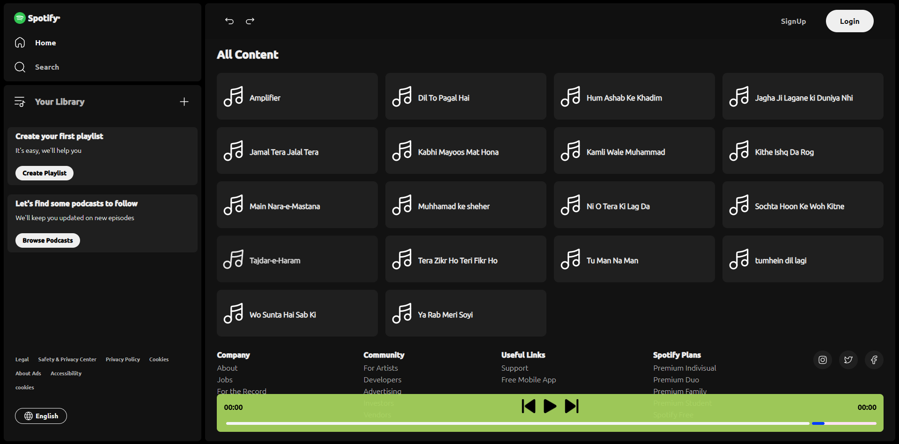
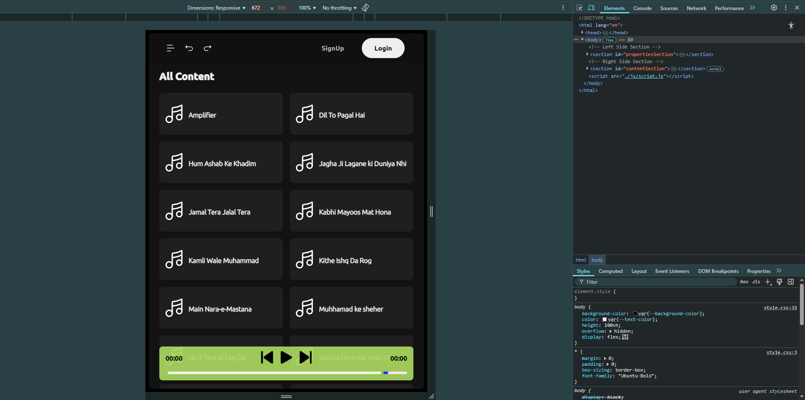

# Spotify Clone 🎵

A polished, responsive music‑player interface inspired by Spotify—built using pure **HTML**, **CSS**, and **JavaScript**. No frameworks or dependencies involved.

  


Designed for intuitive, lightweight audio playback and front‑end prototyping. Perfect for quick demos or to study audio UI logic.

---

## 🎶 Features

- Clickable play/pause controls for each track  
- Skip to next or previous song  
- Interactive seek bar to navigate within a track  
- Dynamic "Now Playing" display with title and album artwork  
- Fully responsive fullscreen layout—mobile and desktop friendly

---

## 🧭 Getting Started

Clone the repository:
```bash
git clone https://github.com/Fahad090NP/Spotify-Clone.git
